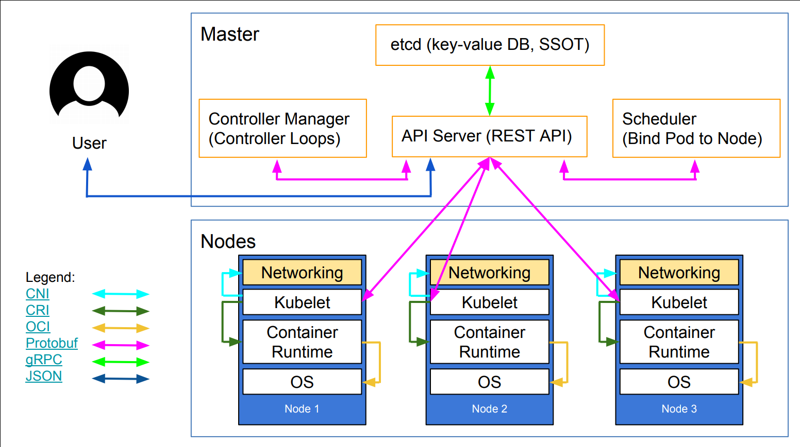

## Kubernetes architecture

- Ha ha ha ha
- OK, I was trying to scare you, it's much simpler than that
- The previous schema is a Kubernetes cluster with storage backed by multi-path iSCSI

(Courtesy of [Imesh Gunaratne](https://medium.com/containermind/a-reference-architecture-for-deploying-wso2-middleware-on-kubernetes-d4dee7601e8e))

### the nodes

- The nodes executing our containers run a collection of services:

  - a container Engine (typically Docker)

  - kubelet (the "node agent")

  - kube-proxy (a necessary but not sufficient network component)

- Nodes were formerly called "minions"

  (You might see that word in older articles or documentation)

---

## the control plane

- The Kubernetes logic (its "brains") is a collection of services:

  - the API server (our point of entry to everything!)
  - core services like the scheduler and controller manager
  - `etcd` (a highly available key/value store; the "database" of Kubernetes)

- Together, these services form the control plane of our cluster

- The control plane is also called the "master"

